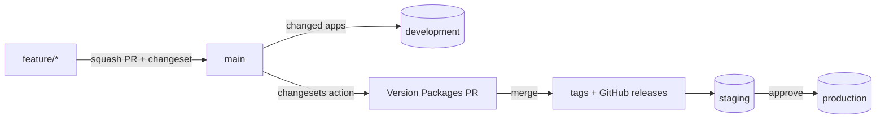

# changesets-demo

A pnpm workspace that shows **trunk-based releases with [changesets](https://github.com/changesets/changesets)**: every package is versioned and deployed on its own, only what changed gets deployed, and unfinished work ships switched off behind **feature flags** instead of being held back in git.

Deploys are **simulated**: each deploy job runs in a GitHub environment (so GitHub records a deployment) and lists what it would ship in the job summary.

## The workspace

| Package | Path | Depends on |
| --- | --- | --- |
| `@demo/ui` | `packages/ui` | — |
| `@demo/flags` | `packages/flags` | — |
| `@demo/web` | `apps/web` | `@demo/ui`, `@demo/flags` |
| `@demo/admin` | `apps/admin` | `@demo/ui` |
| `@demo/api` | `apps/api` | — |

A change to `@demo/ui` also bumps and redeploys `web` and `admin` (changesets' `updateInternalDependencies`); a change to `api` ships `api` alone.

```sh
pnpm install
pnpm build && pnpm test
pnpm changeset            # describe your change: packages, bump type, summary
pnpm changeset --empty    # docs, CI and other changes that release nothing
```

## The flow



1. **Work on a branch, merge to main.** Open a PR into `main` with a changeset, and squash-merge it. The required checks are `changeset` and `test`.
2. **Development.** Every merge deploys the apps it changed, and the apps depending on them, to **development** (`scripts/affected.mjs`).
3. **Version Packages PR.** The [changesets action](https://github.com/changesets/action) keeps one PR open that applies all pending changesets: new versions and changelog entries. Each entry links the short commit hash and the PR, and thanks its author ("Thanks @user!"), from [`@changesets/changelog-github`](https://github.com/changesets/changesets/tree/main/packages/changelog-github).
4. **Release.** Merging that PR tags each new version (`@demo/ui@1.1.0`), creates a GitHub release with its changelog, deploys those versions to **staging**, and after approval of the **production** environment, to production. The same versions go to both.

There's no `dev` branch, no release branch and no back-merge: `main` is always what's deployable.

## Feature flags instead of holding changes back

Unfinished or risky work is merged and deployed **switched off**. Deciding what users see is a flag change, not a git operation.

```js
import { isEnabled, loadFlags } from "@demo/flags";

if (isEnabled(loadFlags(), "new-checkout", { userId })) {
  return newCheckout();
}
return checkout();
```

A flag's value lives in `flags/<environment>.json`:

| Value | Meaning |
| --- | --- |
| `true` / `false` | on or off for everyone |
| `{ "users": ["jano"] }` | on for these users only (testers) |
| `{ "percent": 10 }` | on for a stable 10% of users |

Unknown flags are off, so code can ship before its flag exists. In this demo, `new-checkout` is on in development, on for one user in staging, and off in production.

**Flipping a flag** is a PR that only touches `flags/`: it needs no changeset, and the `flags` job publishes the file to its environment without deploying any app. In a real setup the values live in a flag service (PostHog, LaunchDarkly, Statsig) or a key-value store (Cloudflare KV); only `loadFlags` changes.

**Lifecycle of a flag:**
1. add it (off) with the first PR of the feature;
2. turn it on for testers, then a percentage, then everyone;
3. remove the flag and the old code path in a cleanup PR. Flags nobody removes are the main cost of this approach.

**Hotfix:** a normal PR into `main` with a changeset, then merge the Version Packages PR. If a new feature misbehaves, switch its flag off first: that takes effect without a deploy.

## Setup (already done for this repo)

- Merge methods: squash only, branches deleted after merge.
- Actions may create pull requests (Settings → Actions → General).
- Ruleset on `main`: PR required, squash only, required checks `changeset` and `test`, no force pushes or deletion. The Version Packages PR passes the changeset check by its branch name (`changeset-release/*`). Admins may bypass the ruleset, in case that PR's checks don't start (a PR opened with the workflow token often triggers no workflows; closing and reopening it does).
- Environments: `development` and `staging` (no gate), `production` (required reviewer).

## Why not hold back changes in git?

An earlier version of this demo built the release from `main` plus cherry-picked commits, so single commits could be held back. It worked, but:
- releases ran combinations nobody had tested together;
- later commits depended on held-back ones;
- `main` and the integration branch drifted apart;
- it needed a few hundred lines of custom release scripts.

Feature flags keep one branch, test what ships, and decide visibility at runtime.
